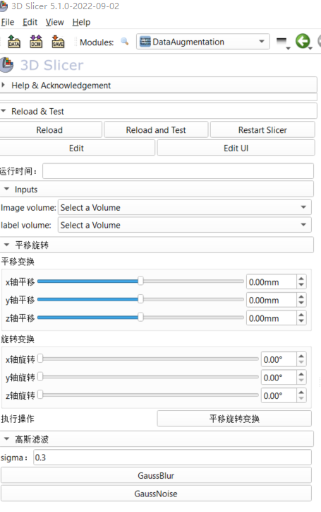
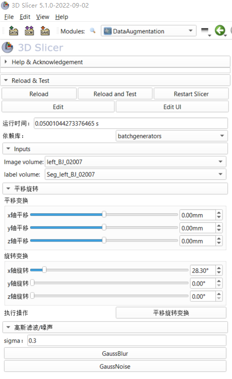

# DataAugmentation

## 软件界面

添加依赖库选择

todo

- [x] 实现平移、旋转数据增强；
- [x] 实现高斯滤波增强；
- [ ] 实现高斯噪声增强；
- [x] 实现运行时间显示；
- [x] 实现不同实现方式切换与对比；
- [ ] 

## 软件功能

参考调用与实现：[batchgenerators/batchgenerators/examples/brats2017/brats2017_dataloader_3D.py at 7738768bddd87217607583fe0abbc600f7682513 · MIC-DKFZ/batchgenerators (github.com)](https://github.com/MIC-DKFZ/batchgenerators/blob/7738768bddd87217607583fe0abbc600f7682513/batchgenerators/examples/brats2017/brats2017_dataloader_3D.py#L14)

todo 增强方法：

- [ ] 高斯噪声；
- [ ] 高斯模糊；
- [ ] 亮度增强；
- [ ] 对比度增强；
- [ ] 模拟低分辨率；
- [ ] gamma变换；
- [x] 旋转变换；
- [x] 平移变换；
- [ ] 镜像变换；
- [ ] 

